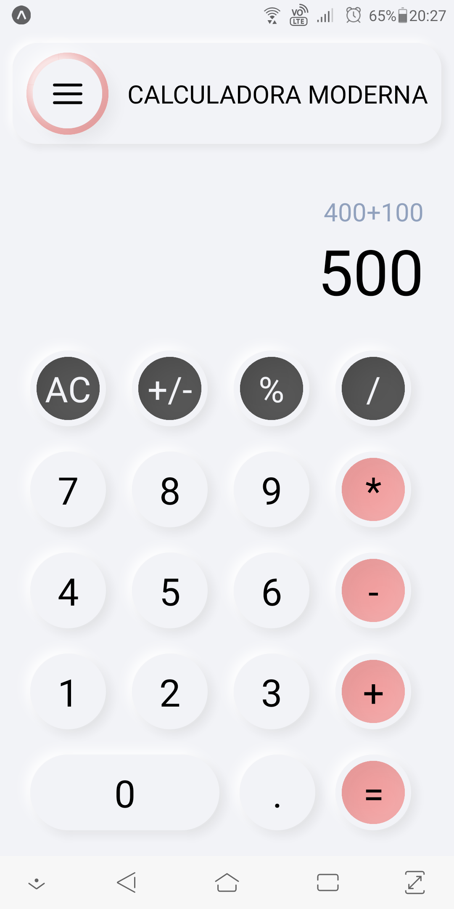

<h4 align="center">

 Calculador Moderna - Neumorphism Design
</h4>

    

## :bulb: Objetivo do projeto

Calcula com funcionalidades simples, porém com um designer moderno utilizando técnicas de neumorphism.

## :computer: Técnologias

- [Neumorphism Shadows](https://github.com/tokkozhin/react-native-neomorph-shadows)

## :iphone: Design de tela

 ## :tv: Redes Sociais
 
    
  
   
  
   

  